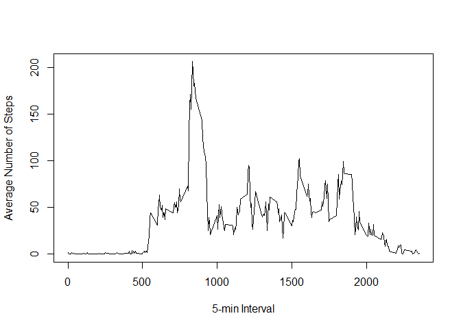
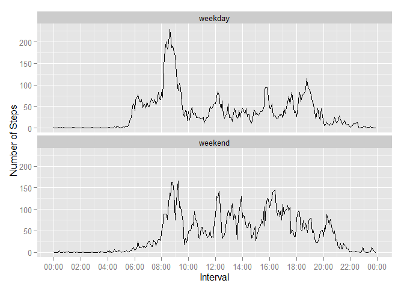

Reproducible Research: Peer Assessment 1  
========================================
Siew Choo  
*date: Thursday, March 12, 2015*


```r
## Load and attach packages.
library(dplyr)
library(ggplot2)
library(lubridate)
library(scales)
```


##  
  
This script file assumes that you have downloaded [repdata-data-activity.zip](https://d396qusza40orc.cloudfront.net/repdata%2Fdata%2Factivity.zip) and unzipped its contents into the same directory as the script.  
   
   
### Loading and preprocessing the data
To have a feel of what the data looks like, I:  
1) Opened the CSV file in Microsoft Excel and examined the first and last few rows of the file.  
  
It was noted that  
- it had 3 columns - *steps*, *date*, *interval*  
- a header was present  
- missing data in the *steps* variable was encoded as "NA" strings.  
  
Thus, I made the necessary provisions in the file read to skip the header and convert the "NA" strings to R's missing value indicator.  
  

```r
## 1. Load the data.
rawDf <- read.csv("activity.csv", sep=",", header = TRUE, stringsAsFactors=FALSE, na.strings="NA")
```
  
2) Scope out the basic structure of the dataset.
  

```
## 'data.frame':	17568 obs. of  3 variables:
##  $ steps   : int  NA NA NA NA NA NA NA NA NA NA ...
##  $ date    : chr  "2012-10-01" "2012-10-01" "2012-10-01" "2012-10-01" ...
##  $ interval: int  0 5 10 15 20 25 30 35 40 45 ...
```

3) Determine which columns had NAs.  
 

```
##    steps     date interval 
##     TRUE    FALSE    FALSE
```
  
As shown, *steps* is the only variable with missing values.  
  
The dataset was relatively clean and the only preprocessing required was to  
- convert the *date* strings to R's date object  
- convert the irregular length *interval* string to a fixed length string of 4 characters.  
    

```r
## 2. Process/transform the data (if necessary) into a format suitable for your analysis.
rawDf$date <- as.Date(rawDf$date, "%Y-%m-%d")
rawDf$interval <- sprintf("%04d", rawDf$interval)
```
  
   
### What is mean total number of steps taken per day?  
For this part of the assignment, we were told to ignore the missing values in the dataset. I have assumed this to mean that we are to exclude observations with  missing values. To accomplish this, I have used the na.omit() function.  
    

```r
byDay <-
    na.omit(rawDf) %>% 
	select(steps, date, interval) %>%
	group_by(date) %>%
	summarize(totalSteps = sum(steps))
```


```r
## 2. Make a histogram of the total number of steps taken each day.
noOfDays <- length(unique(rawDf$date))	## No of days but how to incorporate it into qplot??
with(byDay, 
     hist(byDay$totalSteps, 
         breaks=noOfDays, 
         col="red", 
         main="Total Number of Steps Taken Per Day", 
         xlab="Total Number of Steps", 
         ylab="Count"))
```

 


```r
## 3. Calculate and report the mean and median of the total number of steps taken per day.
mean(byDay$totalSteps)
```

```
## [1] 10766.19
```

```r
median(byDay$totalSteps)
```

```
## [1] 10765
```
  
  
### What is the average daily activity pattern?

```r
byInterval <-
    rawDf %>% 
	group_by(interval) %>%
	summarize(avgSteps = round(mean(steps, na.rm=TRUE)))

byInterval$intervalDateObj <- strptime(byInterval$interval, format="%H%M")

## 1. Make a time series plot (i.e. type = "l") of the 5-minute interval (x-axis) and the average number of steps taken, averaged across all days (y-axis).
ggplot(data=byInterval, aes(x=intervalDateObj, y=avgSteps)) +
    scale_x_datetime(labels=(date_format("%H:%M")), breaks="2 hours") +
    geom_line() + 
    xlab("5-min Interval") + 
    ylab("Average Number of Steps")
```

 


```r
## 2. Which 5-minute interval, on average across all the days in the dataset, contains the maximum number of steps?
byInterval[which.max(byInterval$avgSteps), "interval"]
```

```
## Source: local data frame [1 x 1]
## 
##   interval
## 1     0835
```
  
Based on the data, highest activity was detected in the morning at 08:35.  
  
### Imputing missing values  
It is worth noting that the presence of missing data may introduce bias into some calculations or summaries of the data. In this part of the assignment, we will be looking at the effects of imputation on our dataset.  
  

```r
## 1. Calculate and report the total number of missing values in the dataset (i.e. the total number of rows with NAs)
sum(is.na(rawDf$steps))
```

```
## [1] 2304
```
   
The number of observations in the dataset containing NAs is approximately 2300 rows or 13% of all observations.  
   

```r
## 2. Devise a strategy for filling in all of the missing values in the dataset. 
##    The strategy does not need to be sophisticated. 
##    For example, you could use the mean/median for that day, or the mean for that 5-minute interval, etc.
```
  
As my imputation strategy, I have chosen to replace missing values for the *steps* variable with the mean for the corresponding 5-minute interval, averaged across all days.  
   

```r
## 3. Create a new dataset that is equal to the original dataset but with the missing data filled in.
naIdx <- which(is.na(rawDf$steps))

imputedDf <- rawDf
for (i in naIdx) {
    imputedDf$steps[i] <- with(byInterval, avgSteps[interval == imputedDf$interval[i]])
}
```
  
For ease of comparison, I have  
- placed the before and after imputation plots side by side although it was not stated as a task requirement.  
  * On the left is the requested histogram plotted with the new imputed dataset.  
  * On the right is the histogram plotted with the raw dataset with the NAs removed.  
  
- plotted a mean line for both histograms  
  
- included the before and after imputation summaries.  
  

```r
## 4. Make a histogram of the total number of steps taken each day.
##    Calculate and report the mean and median total number of steps taken per day. 
##    Do these values differ from the estimates from the first part of the assignment? 
##    What is the impact of imputing missing data on the estimates of the total daily number of steps?
##
byDayImputed <-
	imputedDf %>% 
	select(steps, date, interval) %>%
	group_by(date) %>%
	summarize(totalSteps = sum(steps))

## Plot the histogam based on data from the imputed dataset.
gImp <- ggplot(byDayImputed, aes(x=totalSteps)) + 
	geom_histogram(binwidth=500, colour="black", fill="steelblue") +
	labs(title="Total Steps Per Day(Imputed)", x="Total steps", y="Count") + 
	geom_vline(aes(xintercept=mean(totalSteps, na.rm=T)), color="red", linetype="dashed", size=1)

## Plot the histogram based on the original dataset with NAs removed.
gNoNA <- ggplot(byDay, aes(x=totalSteps)) + 
	geom_histogram(binwidth=500, colour="black", fill="steelblue") +
	labs(title="Total Steps Per Day(Non-imputed)", x="Total steps", y="Count") + 
	geom_vline(aes(xintercept=mean(totalSteps, na.rm=T)), color="red", linetype="dashed", size=1)

## Function courtesy of Winston Chang's R cookbook
multiplot(gImp, gNoNA, cols=2)
```

```
## Loading required package: grid
```

 

```r
summary(byDay$totalSteps)
```

```
##    Min. 1st Qu.  Median    Mean 3rd Qu.    Max. 
##      41    8841   10760   10770   13290   21190
```

```r
summary(byDayImputed$totalSteps)
```

```
##    Min. 1st Qu.  Median    Mean 3rd Qu.    Max. 
##      41    9819   10760   10770   12810   21190
```
   
Based on the summaries, the reported mean and median before and after the imputation remains the same. Greater observable differences can be seen in the 1st and 3rd quantiles although the differences are fairly small.     
   
Imputing missing data has caused the estimates of the total daily number of steps to increase since observations that were previously excluded is now populated with interval means. While the shapes of the before and after histograms are largely the same, the scale of the Y-axis has noticeably moved up, meaning we are now seeing an entire upward shift of the curve with more days with higher total steps per day.  
  
  
### Are there differences in activity patterns between weekdays and weekends?

```r
## For this part the weekdays() function may be of some help here. Use the dataset with the filled-in missing values for this part.
##
## 1. Create a new factor variable in the dataset with two levels - "weekday" and "weekend" indicating whether a given date is a weekday or weekend day.
##
imputedDf$partOfWeek <- as.factor(ifelse(weekdays(imputedDf$date) %in% c("Saturday","Sunday"), "weekend", "weekday")) 
```
  
  

```r
## 2. Make a panel plot containing a time series plot (i.e. type = "l") of the 5-minute interval (x-axis) and the average number of steps taken, averaged across all weekday days or weekend days (y-axis). 
##    See the README file in the GitHub repository to see an example of what this plot should look like using simulated data.
##
byIntervalImputed <- aggregate(steps~interval+partOfWeek, data=imputedDf, mean)
byIntervalImputed$intervalDateObj <- strptime(byIntervalImputed$interval, format="%H%M")
    
ggplot(data=byIntervalImputed, aes(x=intervalDateObj, y=steps)) +
    scale_x_datetime(labels=(date_format("%H:%M")), breaks="2 hours") +
    geom_line() + 
    xlab("Interval") + 
    ylab("Number of Steps") +
    facet_wrap(~partOfWeek, ncol=1)
```

 
   
The plot for weekday displays greater volatility with a very high rate of movement between the 08:00-09:30 intervals. Other distinct spikes are around 12:00, 16:00 and 19:00. These movements likely correspond to going off to work, lunch break, teabreak/going off work early and getting off work. The rest of the day averaged about 50 steps per 5-minute interval.  
  
The weekend plot, by comparison, has a much flatter overall profile, implying more constant movement throughout Saturday and Sunday. The data suggests that the test subjects started their day at about 08:30-09:30. A sustained cluster of spikes after 12:00 and tapering off at 21:00 shows that the subjects were engaged in continous activities during these hours.  
  
The graphs also reveal that the subjects slept in later and started their days more slowly on the weekend. On a weekday, a marked increase in the steps taken starting from around interval 06:00, up until interval 09:00 can be observed as they possibly made their way to work. The test subjects also appear to head for bed ealier on a weekday (at 20:00) versus the weekend (at 22:00).  
  
